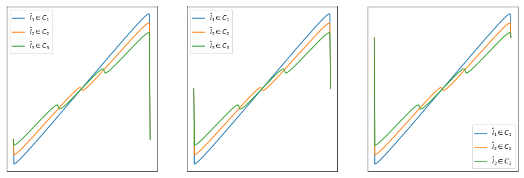

# Cumulative Distribution Transform


Cumulative distribution transform (CDT) as described in:

[(1) Park SR, Kolouri S, Kundu S, Rohde GK. The cumulative distribution transform and linear pattern classification. Applied and Computational Harmonic Analysis. 2017 Feb 22.](http://www.sciencedirect.com/science/article/pii/S1063520317300076)

is a nonlinear and invertible transformation for nonnegative one-dimensional signals that guarantees certain linear separation theorems. CDT rises from the rich mathematical foundations of optimal mass transportation, and therefore has a unique geometric interpretation. Unlike the current data extensive nonlinear models, including deep neural networks and their variations, CDT provides a well-defined invertible nonlinear transformation that could be used alongside linear modeling techniques, including principal component analysis, linear discriminant analysis, and support vector machines (SVM), and does not require extensive training data.

 The corresponding iPython Notebook file for this post could be find [here](https://github.com/skolouri/Cumulative-Distribution-Transform/blob/master/CDT_Notebook.ipynb). The demo is tested with:

1. numpy '1.13.1'
2. sklearn '0.18.1'
3. scipy '0.19.1'

Here we first walk you through the formulation of CDT and then demonstrate its application on various demos.

## Formulation

Consider two nonnegative one-dimensional signals $I_0$ and $I$ defined on $X,Y\subset\mathbb{R}$. Without the loss of generality assume that these signals are normalized so that they could be treated as probability density functions (PDFs). Considering $I_0$ to be a pre-determined 'template'/'reference' PDF, and following the definition of the **optimal mass transportation**  for one-dimensional distributions, one can define the optimal transport map, $f:X \rightarrow Y$ using,

\[ \int_{inf(Y)}^{f(x)} I(\tau) d\tau=\int_{inf(X)}^{x}I_0(\tau)d\tau\]

which uniquely associates $f:X\rightarrow Y$ to the given density $I$.

### Forward Transform
We use this relationship to define the ** Cumulative Distribution Transform (CDT)** of $I$ (denoted as $\hat{I}: X \to \mathbb{R}$), with respect to the reference $I_0$:

\[\hat{I}(x) = \left(  f(x) - x \right) \sqrt{I_0(x)}.\]

For one-dimensional PDFs the transport map $f$ is uniquely defined, and can be calculated from:

\[f(x)=J^{-1}(J_0(x)).\]

where $J_0: X \to [0,1]$ and $J: Y \to [0,1]$ are the corresponding cumulative distribution functions (CDFs) for ${I}_0$ and $I$, that is: $J_0(x) = \int_{\inf(X)}^x I_0(\tau) d\tau$, $J(y) = \int_{\inf(Y)}^y I(\tau) d\tau$. For continuous positive PDFs $I_0$ and $I$, $f$ is a continuous and monotonically increasing function. If $f$ is differentiable, we can rewrite the above equation as:

\[I_0(x) = f^{\prime}(x) I(f(x)).\]

### Inverse Transform

The Inverse-CDT of $\hat{I}$ is defined as:
\[I(y) = \frac{d }{dy}J_0(f_1^{-1}(y)) = (f_1^{-1})^{\prime} I_0(f^{-1}(y))\]

where $f^{-1}: Y \to X$ refers to the inverse of $f$ (i.e. $f^{-1}(f(x)) = x$), and where $f(x) =  {\hat{I}_1(x)}/{\sqrt{I_0(x)}} + x$. The equation above holds for points where $J_0$ and $f$ are differentiable. By the construction above, $f$ will be differentiable except for points where $I_0$ and $I_1$ are discontinuous. Now we are ready to delve into some exciting applications of CDT.

## CDT Demo

Throughout the experiments in this tutorial we assume that: 1) $X=Y$, and 2) the template PDF is the uniform distribution on $X$. Lets start by showing the nonlinear nature of CDT.

### Nonlinearity

Let $I_1$ and $I_2$ be two one-dimensional Gaussian distributions, where:
\[I_i(x)= \frac{1}{\sqrt{2\pi\sigma_i^2}}exp({-\frac{|x-\mu_i|^2}{2\sigma_i^2}})\]
and let $\hat{I}_i$ denotes the corresponding CDTs. The signals and their CDT could for instance be calculated from the code below:

```python
import numpy as np
import transportBasedTransforms.cdt as CDT
#Define the template (Reference) PDF
N=250
I0= (1.0/N)*np.ones(N)
cdt=CDT.CDT(template=I0)
# Define the signals I_i and calculate their CDT
mu=np.array([25,200]) #Means
sigma=np.array([5,10])#stds
I=np.zeros((2,N))
Ihat=np.zeros((2,N))
for i in range(2):
    I[i,:]=1/(sigma[i]*np.sqrt(2*np.pi))*np.exp(-((x-mu[i])**2)/(2*sigma[i]**2))
    Ihat[i,:]=cdt.transform(I[i,:])
```
which results in,


Now to demonstrate the nonlinear nature of CDT, we choose the simplest linear operator, which is averaging the two signals. We average the signals in the signal space, $I_3=0.5(I_1+I_2)$, and in the CDT space, $I_4=\text{iCDT}(0.5(\hat{I}_1+\hat{I}_2))$, and compare the results below.

```python
I3=I.mean(axis=0)
I4=cdt.itransform(Ihat.mean(axis=0)
```
which results in,


It can be clearly seen that CDT provides a nonlinear averaging for these signals. Note that we don't have a specific model for Gaussians and while CDT is unaware of the parametric formulation of the signals it can still provide a meaningful average. Next we will discuss the linear separability characteristic of CDT.

### Linear separability

Park et al. (1) showed that CDT can turn certain not linearly separable classes of one-dimensional signals into linearly separable ones. Here we run a toy example to demonstrate this characteristic. We start by defining three classes of signals, where Class $k$, for $k\in\{1,2,3\}$, consists of translated versions of a $k$-modal Gaussian distribution. Here we generate these signal classes and their corresponding CDTs.

```python
K=3 # Number of classes
L=500 # Number of datapoints per class  
I=np.zeros((K,L,N))
Ihat=np.zeros((K,L,N))
kmodal_shift=[]
kmodal_shift.append(np.array([0]))
kmodal_shift.append(np.array([-15,15]))
kmodal_shift.append(np.array([-30,0,30]))
sigma=5
for k in range(K):
    for i,mu in enumerate(np.linspace(50,200,L)):
        for j in range(k+1):
            I[k,i,:]+=1/((k+1)*sigma*np.sqrt(2*np.pi))*np.exp(-((x-mu-kmodal_shift[k][j])**2)/(2*sigma**2))
        Ihat[k,i,:]=cdt.transform(I[k,i,:])
```

This leads to the following signals:




Next we run a simple linear classification on these signals in the original space and in the CDT space.

```python
from sklearn.discriminant_analysis import LinearDiscriminantAnalysis
lda=LinearDiscriminantAnalysis(n_components=2) #Get the classifier object
X=np.reshape(I,(K*L,N))      #Combine the signals into a features vector X
Xhat=np.reshape(Ihat,(K*L,N))     #Combine the transformed signals into a features vector Xhat
data=[X,Xhat]
label=np.concatenate((np.zeros(L,),np.ones(L,),-1*np.ones(L,))) # Define the labels as -1,0,1 for the three classes
dataLDA=[[],[]]
for i in range(2):
    dataLDA[i]=lda.fit_transform(data[i],label)
```

Below we visualize the two-dimensional discriminant subspace calculated by the linear discriminant analysis (LDA).


It can be clearly seen that while the classes are not linearly separable in the original space (Note the one-dimensional nonlinear manifold structure of each class), the CDT representations of the signals is linearly separable.
